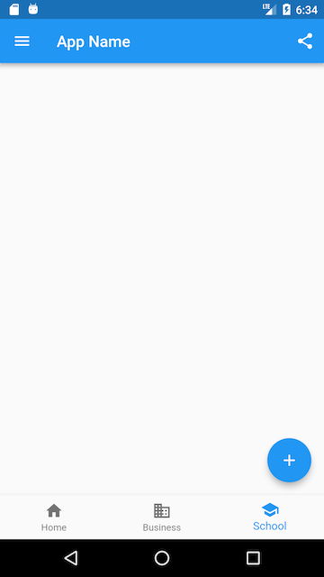
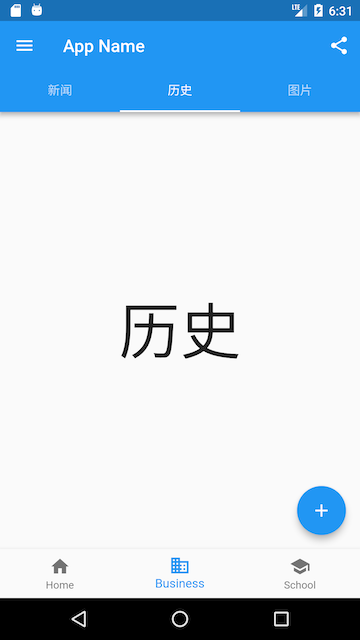

# 5.6 Scaffold、TabBar、底部导航

Material组件库提供了丰富多样的组件，本节介绍一些常用的组件，其余的读者可以自行查看文档或Flutter Gallery中Material组件部分的示例。

> Flutter Gallery是Flutter官方提供的Flutter Demo，源码位于flutter源码中的examples目录下，笔者强烈建议用户将Flutter Gallery示例跑起来，它是一个很全面的Flutter示例应用，是非常好的参考Demo，也是笔者学习Flutter的第一手资料。

## 5.6.1 Scaffold

一个完整的数路由页可能会包含导航栏、抽屉菜单(Drawer)以及底部Tab导航菜单等。如果每个路由页面都需要开发者自己手动去实现这些，这会是一件非常麻烦且无聊的事。幸运的是，Flutter Material组件库提供了一些现成的组件来减少我们的开发任务。`Scaffold`是一个路由页的骨架，我们使用它可以很容易地拼装出一个完整的页面。

### 示例

我们实现一个页面，它包含：

1. 一个导航栏
2. 导航栏右边有一个分享按钮
3. 有一个抽屉菜单
4. 有一个底部导航
5. 右下角有一个悬浮的动作按钮

最终效果如图5-18、图5-19所示：

 


实现代码如下：

```dart
class ScaffoldRoute extends StatefulWidget {
  @override
  _ScaffoldRouteState createState() => _ScaffoldRouteState();
}

class _ScaffoldRouteState extends State<ScaffoldRoute> {
  int _selectedIndex = 1;

  @override
  Widget build(BuildContext context) {
    return Scaffold(
      appBar: AppBar( //导航栏
        title: Text("App Name"), 
        actions: <Widget>[ //导航栏右侧菜单
          IconButton(icon: Icon(Icons.share), onPressed: () {}),
        ],
      ),
      drawer: new MyDrawer(), //抽屉
      bottomNavigationBar: BottomNavigationBar( // 底部导航
        items: <BottomNavigationBarItem>[
          BottomNavigationBarItem(icon: Icon(Icons.home), title: Text('Home')),
          BottomNavigationBarItem(icon: Icon(Icons.business), title: Text('Business')),
          BottomNavigationBarItem(icon: Icon(Icons.school), title: Text('School')),
        ],
        currentIndex: _selectedIndex,
        fixedColor: Colors.blue,
        onTap: _onItemTapped,
      ),
      floatingActionButton: FloatingActionButton( //悬浮按钮
          child: Icon(Icons.add),
          onPressed:_onAdd
      ),
    );
  }
  void _onItemTapped(int index) {
    setState(() {
      _selectedIndex = index;
    });
  }
  void _onAdd(){
  }
}
```

上面代码中我们用到了如下组件：

| 组件名称             | 解释           |
| -------------------- | -------------- |
| AppBar               | 一个导航栏骨架 |
| MyDrawer             | 抽屉菜单       |
| BottomNavigationBar  | 底部导航栏     |
| FloatingActionButton | 漂浮按钮       |

下面我们来分别介绍一下它们。

## 5.6.2 AppBar

`AppBar`是一个Material风格的导航栏，通过它可以设置导航栏标题、导航栏菜单、导航栏底部的Tab标题等。下面我们看看AppBar的定义：

```dart
AppBar({
  Key key,
  this.leading, //导航栏最左侧Widget，常见为抽屉菜单按钮或返回按钮。
  this.automaticallyImplyLeading = true, //如果leading为null，是否自动实现默认的leading按钮
  this.title,// 页面标题
  this.actions, // 导航栏右侧菜单
  this.bottom, // 导航栏底部菜单，通常为Tab按钮组
  this.elevation = 4.0, // 导航栏阴影
  this.centerTitle, //标题是否居中 
  this.backgroundColor,
  ...   //其它属性见源码注释
})
```

如果给`Scaffold`添加了抽屉菜单，默认情况下`Scaffold`会自动将`AppBar`的`leading`设置为菜单按钮（如上面截图所示），点击它便可打开抽屉菜单。如果我们想自定义菜单图标，可以手动来设置`leading`，如：

```dart
Scaffold(
  appBar: AppBar(
    title: Text("App Name"),
    leading: Builder(builder: (context) {
      return IconButton(
        icon: Icon(Icons.dashboard, color: Colors.white), //自定义图标
        onPressed: () {
          // 打开抽屉菜单  
          Scaffold.of(context).openDrawer(); 
        },
      );
    }),
    ...  
  )  
```

代码运行效果如图5-20所示：


可以看到左侧菜单已经替换成功。

代码中打开抽屉菜单的方法在`ScaffoldState`中，通过`Scaffold.of(context)`可以获取父级最近的`Scaffold` 组件的`State`对象，原理可以参考本书后面“Element与BuildContext” 一章。Flutter还有一种通用的获取`State`对象的方法——通过GlobalKey来获取！ 步骤分两步：

1. 给目标`StatefulWidget`添加`GlobalKey`。

   ```dart
   //定义一个globalKey, 由于GlobalKey要保持全局唯一性，我们使用静态变量存储
   static GlobalKey<ScaffoldState> _globalKey= new GlobalKey();
   ...
   Scaffold(
       key: _globalKey , //设置key
       ...  
   )
   ```

2. 通过`GlobalKey`来获取`State`对象

   ```dart
   _globalKey.currentState.openDrawer()
   ```

### TabBar

下面我们通过“bottom”属性来添加一个导航栏底部Tab按钮组，将要实现的效果如图5-21所示：


Material组件库中提供了一个`TabBar`组件，它可以快速生成`Tab`菜单，下面是上图对应的源码：

```dart
class _ScaffoldRouteState extends State<ScaffoldRoute>
    with SingleTickerProviderStateMixin {

  TabController _tabController; //需要定义一个Controller
  List tabs = ["新闻", "历史", "图片"];

  @override
  void initState() {
    super.initState();
    // 创建Controller  
    _tabController = TabController(length: tabs.length, vsync: this);
  }

  @override
  Widget build(BuildContext context) {
    return Scaffold(
      appBar: AppBar(
        ... //省略无关代码
        bottom: TabBar(   //生成Tab菜单
          controller: _tabController,
          tabs: tabs.map((e) => Tab(text: e)).toList()
        ),
      ),
      ... //省略无关代码

  }
```

上面代码首先创建了一个`TabController` ，它是用于控制/监听`Tab`菜单切换的。接下来通过TabBar生成了一个底部菜单栏，`TabBar`的`tabs`属性接受一个Widget数组，表示每一个Tab子菜单，我们可以自定义，也可以像示例中一样直接使用`Tab` 组件，它是Material组件库提供的Material风格的Tab菜单。

`Tab`组件有三个可选参数，除了可以指定文字外，还可以指定Tab菜单图标，或者直接自定义组件样式。`Tab`组件定义如下：

```dart
Tab({
  Key key,
  this.text, // 菜单文本
  this.icon, // 菜单图标
  this.child, // 自定义组件样式
})
```

开发者可以根据实际需求来定制。

### TabBarView

通过`TabBar`我们只能生成一个静态的菜单，真正的Tab页还没有实现。由于`Tab`菜单和Tab页的切换需要同步，我们需要通过`TabController`去监听Tab菜单的切换去切换Tab页，代码如：

```dart
_tabController.addListener((){  
  switch(_tabController.index){
    case 1: ...;
    case 2: ... ;   
  }
});
```

如果我们Tab页可以滑动切换的话，还需要在滑动过程中更新TabBar指示器的偏移！显然，要手动处理这些是很麻烦的，为此，Material库提供了一个`TabBarView`组件，通过它不仅可以轻松的实现Tab页，而且可以非常容易的配合TabBar来实现同步切换和滑动状态同步，示例如下：

```dart
Scaffold(
  appBar: AppBar(
    ... //省略无关代码
    bottom: TabBar(
      controller: _tabController,
      tabs: tabs.map((e) => Tab(text: e)).toList()),
  ),
  drawer: new MyDrawer(),
  body: TabBarView(
    controller: _tabController,
    children: tabs.map((e) { //创建3个Tab页
      return Container(
        alignment: Alignment.center,
        child: Text(e, textScaleFactor: 5),
      );
    }).toList(),
  ),
  ... // 省略无关代码  
)    
```

运行后效果如图5-22所示：



现在，无论是点击导航栏Tab菜单还是在页面上左右滑动，Tab页面都会切换，并且Tab菜单的状态和Tab页面始终保持同步！那它们是如何实现同步的呢？细心的读者可能已经发现，上例中`TabBar`和`TabBarView`的`controller`是同一个！正是如此，`TabBar`和`TabBarView`正是通过同一个`controller`来实现菜单切换和滑动状态同步的，有关`TabController`的详细信息，我们不再本书做过多介绍，使用时读者直接查看SDK即可。

另外，Material组件库也提供了一个`PageView` 组件，它和`TabBarView`功能相似，读者可以自行了解一下。


## 5.6.3 抽屉菜单Drawer

`Scaffold`的`drawer`和`endDrawer`属性可以分别接受一个Widget来作为页面的左、右抽屉菜单。如果开发者提供了抽屉菜单，那么当用户手指从屏幕左（或右）侧向里滑动时便可打开抽屉菜单。本节开始部分的示例中实现了一个左抽屉菜单`MyDrawer`，它的源码如下：

```dart
class MyDrawer extends StatelessWidget {
  const MyDrawer({
    Key key,
  }) : super(key: key);

  @override
  Widget build(BuildContext context) {
    return Drawer(
      child: MediaQuery.removePadding(
        context: context,
        //移除抽屉菜单顶部默认留白
        removeTop: true,
        child: Column(
          crossAxisAlignment: CrossAxisAlignment.start,
          children: <Widget>[
            Padding(
              padding: const EdgeInsets.only(top: 38.0),
              child: Row(
                children: <Widget>[
                  Padding(
                    padding: const EdgeInsets.symmetric(horizontal: 16.0),
                    child: ClipOval(
                      child: Image.asset(
                        "imgs/avatar.png",
                        width: 80,
                      ),
                    ),
                  ),
                  Text(
                    "Wendux",
                    style: TextStyle(fontWeight: FontWeight.bold),
                  )
                ],
              ),
            ),
            Expanded(
              child: ListView(
                children: <Widget>[
                  ListTile(
                    leading: const Icon(Icons.add),
                    title: const Text('Add account'),
                  ),
                  ListTile(
                    leading: const Icon(Icons.settings),
                    title: const Text('Manage accounts'),
                  ),
                ],
              ),
            ),
          ],
        ),
      ),
    );
  }
}
```

抽屉菜单通常将`Drawer`组件作为根节点，它实现了Material风格的菜单面板，`MediaQuery.removePadding`可以移除Drawer默认的一些留白（比如Drawer默认顶部会留和手机状态栏等高的留白），读者可以尝试传递不同的参数来看看实际效果。抽屉菜单页由顶部和底部组成，顶部由用户头像和昵称组成，底部是一个菜单列表，用ListView实现，关于ListView我们将在后面“可滚动组件”一节详细介绍。

## 5.6.4 FloatingActionButton

`FloatingActionButton`是Material设计规范中的一种特殊Button，通常悬浮在页面的某一个位置作为某种常用动作的快捷入口，如本节示例中页面右下角的"➕"号按钮。我们可以通过`Scaffold`的`floatingActionButton`属性来设置一个`FloatingActionButton`，同时通过`floatingActionButtonLocation`属性来指定其在页面中悬浮的位置，这个比较简单，不再赘述。

## 5.6.5  底部Tab导航栏

我们可以通过`Scaffold`的`bottomNavigationBar`属性来设置底部导航，如本节开始示例所示，我们通过Material组件库提供的`BottomNavigationBar`和`BottomNavigationBarItem`两种组件来实现Material风格的底部导航栏。可以看到上面的实现代码非常简单，所以不再赘述，但是如果我们想实现如图5-23所示效果的底部导航栏应该怎么做呢？


Material组件库中提供了一个`BottomAppBar` 组件，它可以和`FloatingActionButton`配合实现这种“打洞”效果，源码如下：

```dart
bottomNavigationBar: BottomAppBar(
  color: Colors.white,
  shape: CircularNotchedRectangle(), // 底部导航栏打一个圆形的洞
  child: Row(
    children: [
      IconButton(icon: Icon(Icons.home)),
      SizedBox(), //中间位置空出
      IconButton(icon: Icon(Icons.business)),
    ],
    mainAxisAlignment: MainAxisAlignment.spaceAround, //均分底部导航栏横向空间
  ),
)
```

可以看到，上面代码中没有控制打洞位置的属性，实际上，打洞的位置取决于`FloatingActionButton`的位置，上面`FloatingActionButton`的位置为：

```dart
floatingActionButtonLocation: FloatingActionButtonLocation.centerDocked,
```
所以打洞位置在底部导航栏的正中间。

`BottomAppBar`的`shape`属性决定洞的外形，`CircularNotchedRectangle`实现了一个圆形的外形，我们也可以自定义外形，比如，Flutter Gallery示例中就有一个“钻石”形状的示例，读者感兴趣可以自行查看。
